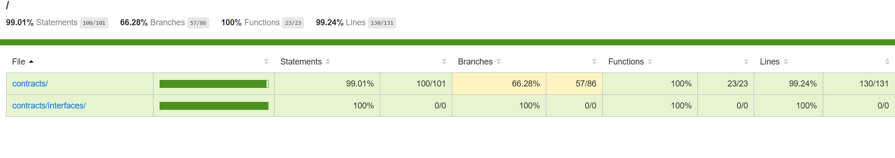

# Confidential Single-Price Auction

The **PrivateSinglePriceAuction** contract is a decentralized auction mechanism that facilitates encrypted bidding for a single-price auction using Fully Homomorphic Encryption (FHE) via the Zama FHEVM. The **AuctionFactory** contract enables the creation and management of multiple auction instances, streamlining deployment and participant management.

---

## Features

### AuctionFactory
- **Automated Auction Deployment**: Deploys new auction contracts with specified parameters.
- **Centralized Management**: Keeps track of all deployed auctions.
- **Participant Access**: Provides access to all auction instances.

### PrivateSinglePriceAuction
- **Encrypted Bidding**: Participants place encrypted bids for privacy.
- **Single-Price Settlement**: Final settlement price is the lowest winning bid.
- **Funds Locking**: Ensures sufficient funds are locked for valid bids.
- **Winner Allocation**: Distributes tokens to winners proportionally to their bids.
- **Automated Fund Management**:
  - Transfers payments to the auction owner.
  - Refunds unused funds to participants.
  - Returns unsold assets to the owner.


---

## Table of Contents
- [Installation](#installation)
- [Usage](#usage)
  - [AuctionFactory](#auctionfactory)
  - [PrivateSinglePriceAuction](#privatesinglepriceauction)
- [Workflow](#workflow)
- [Security Considerations](#security-considerations)
- [License](#license)

---

## Installation

1. Clone this repository.
2. Install dependencies:
   ```bash
   npm install @openzeppelin/contracts
   ```
3. Ensure FHEVM and related configurations are correctly set up.

---

## Usage

### Pre Requisites

Install [pnpm](https://pnpm.io/installation)

Before being able to run any command, you need to create a `.env` file and set a BIP-39 compatible mnemonic as the `MNEMONIC`
environment variable. You can follow the example in `.env.example` or start with the following command:

```sh
cp .env.example .env
```

If you don't already have a mnemonic, you can use this [website](https://iancoleman.io/bip39/) to generate one. An alternative, if you have [foundry](https://book.getfoundry.sh/getting-started/installation) installed is to use the `cast wallet new-mnemonic` command.

Then, install all needed dependencies - please **_make sure to use Node v20_** or more recent:

```sh
pnpm install
```

### Compile

Compile the smart contracts with Hardhat:

```sh
pnpm compile
```

### TypeChain

Compile the smart contracts and generate TypeChain bindings:

```sh
pnpm typechain
```

### Test

Run the tests with Hardhat - this will run the tests on a local hardhat node in mocked mode (i.e the FHE operations and decryptions will be simulated by default):

```sh
pnpm test
```

### Lint Solidity

Lint the Solidity code:

```sh
pnpm lint:sol
```

### Lint TypeScript

Lint the TypeScript code:

```sh
pnpm lint:ts
```


### Clean

Delete the smart contract artifacts, the coverage reports and the Hardhat cache:

```sh
pnpm clean
```

### Mocked mode

The mocked mode allows faster testing and the ability to analyze coverage of the tests. In this mocked version,
encrypted types are not really encrypted, and the tests are run on the original version of the EVM, on a local hardhat
network instance. To run the tests in mocked mode, you can use directly the following command:

```bash
pnpm test
```

You can still use all the usual specific [hardhat network methods](https://hardhat.org/hardhat-network/docs/reference#hardhat-network-methods), such as `evm_snapshot`, `evm_mine`, `evm_increaseTime`, etc, which are very helpful in a testing context. Another useful hardhat feature, is the [console.log](https://hardhat.org/hardhat-network/docs/reference#console.log) function which can be used in fhevm smart contracts in mocked mode as well.

To analyze the coverage of the tests (in mocked mode necessarily, as this cannot be done on the real fhEVM node), you
can use this command :

```bash
pnpm coverage
```

Then open the file `coverage/index.html`. You can see there which line or branch for each contract which has been
covered or missed by your test suite. This allows increased security by pointing out missing branches not covered yet by
the current tests.

Finally, a new fhevm-specific feature is available in mocked mode: the `debug.decrypt[XX]` functions, which can decrypt directly any encrypted value. Please refer to the [utils.ts](https://github.com/zama-ai/fhevm/blob/main/test/utils.ts#L87-L317) file for the corresponding documentation.

> [!Note]
> Due to intrinsic limitations of the original EVM, the mocked version differs in rare edge cases from the real fhEVM, the main difference is the gas consumption for the FHE operations (native gas is around 20% underestimated in mocked mode). This means that before deploying to production, developers should still run the tests with the original fhEVM node, as a final check - i.e in non-mocked mode (see next section).

### Non-mocked mode - Sepolia

To run your test on a real fhevm node, you can use the coprocessor deployed on the Sepolia test network. To do this, ensure you are using a valid value `SEPOLIA_RPC_URL` in your `.env` file. You can get free Sepolia RPC URLs by creating an account on services such as [Infura](https://www.infura.io/) or [Alchemy](https://www.alchemy.com/). Then you can use the following command:

```bash
npx hardhat test [PATH_TO_YOUR_TEST] --network sepolia
```

The `--network sepolia` flag will make your test run on a real fhevm coprocessor. Obviously, for the same tests to pass on Sepolia, contrarily to mocked mode, you are not allowed to use any hardhat node specific method, and neither use any of the `debug.decrypt[XX]` functions.

> [!Note]
> For this test to succeed, first ensure you set your own private `MNEMONIC` variable in the `.env` file and then  ensure you have funded your test accounts on Sepolia. For example you can use the following command to get the corresponding private keys associated with the first `5` accounts derived from the mnemonic: 
```
npx hardhat get-accounts --num-accounts 5
```
This will let you add them to the Metamask app, to easily fund them from your personal wallet. 

If you don't own already Sepolia test tokens, you can for example use a free faucet such as [https://sepolia-faucet.pk910.de/](https://sepolia-faucet.pk910.de/).

Another faster way to test the coprocessor on Sepolia is to simply run the following command:
```
pnpm deploy-sepolia
```
### Etherscan verification

If you are using a real instance of the fhEVM, you can verify your deployed contracts on the Etherscan explorer. 
You first need to set the `ETHERSCAN_API_KEY` variable in the `.env` file to a valid value. You can get such an API key for free by creating an account on the [Etherscan website](https://docs.etherscan.io/getting-started/viewing-api-usage-statistics). 

Then, simply use the `verify-deployed` hardhat task, via this command:
```
npx hardhat verify-deployed --address [ADDRESS_CONTRACT_TO_VERIFY] --contract [FULL_CONTRACT_PATH] --args "[CONSTRUCTOR_ARGUMENTS_COMMA_SEPARATED]" --network [NETWORK_NAME]
```
As a concrete example, to verify the deployed `MyConfidentialERC20` from previous section, you can use:
```
npx hardhat verify-deployed --address [CONFIDENTIAL_ERC20_ADDRESS] --contract contracts/MyConfidentialERC20.sol:MyConfidentialERC20 --args "Naraggara,NARA" --network sepolia
```

Note that you should replace the address placeholder `[CONFIDENTIAL_ERC20_ADDRESS]` by the concrete address that is logged when you run the `pnpm deploy-sepolia` deployment script.

## Detailed Usage

### AuctionFactory

#### Deployment
Deploy the AuctionFactory contract. The factory will act as a central point for deploying and managing auctions.

```
pnpm deploy-sepolia
```

#### Creating a New Auction
To create a new auction, call:
```solidity
function createAuction(
    address _asset,
    address _paymentToken,
    uint256 _quantity,
    uint256 _duration,
    uint256 _maxParticipant
) external;
```
- `_asset`: Address of the ERC20 token being auctioned.
- `_paymentToken`: Address of the ERC20 token for payments (use `address(0)` for Ether).
- `_quantity`: Total quantity of tokens to be auctioned.
- `_duration`: Duration of the auction in seconds.
- `_maxParticipant`: Maximum number of participants allowed.

The function returns the address of the deployed **PrivateSinglePriceAuction** contract.

#### Fetching All Auctions
Retrieve all deployed auctions:
```solidity
function getAllAuctions() external view returns (address[] memory);
```

### Task to run 

```
npx hardhat createAuction --auction-factory-contract [AUCTION_FACTORY_ADDRESS] --asset-contract [ASSET_ADDRESS] --quantity [QUANTITY] --duration [DURATION] --max-participant [MAX_PARTICIPANT] --payment-token [PAYMENT_TOKEN] --network sepolia
```

### PrivateSinglePriceAuction

#### Constructor Parameters
The auction contract is initialized by the factory with the following parameters:
- `address _owner`: Owner of the contract.
- `address _asset`: ERC20 token being auctioned.
- `address _paymentToken`: Token used for payment.
- `uint256 _quantity`: Total quantity of tokens in the auction.
- `uint256 _duration`: Duration of the auction in seconds.
- `uint256 _maxParticipant`: Maximum number of participants.

#### Core Functions

1. **Locking Funds**:
   ```solidity
   function lockFunds(uint256 amount) external payable;
   ```
   - Locks Ether or tokens for bidding.
   - Ensures bid validity.

2. **Placing Encrypted Bids**:
   ```solidity
   function placeEncryptedBid(
       einput _encryptedQuantity,
       einput _encryptedPrice,
       bytes calldata _inputProof
   ) external payable;
   ```
   - Participants submit encrypted bids with encryption proofs.

3. **Settling the Auction**:
   ```solidity
   function settleAuction() external onlyOwner;
   ```
   - Finalizes the auction, decrypts bids, determines winners, and allocates tokens.

4. **Retrieving Bids**:
   - Encrypted bids:
     ```solidity
     function getAllBids() external view returns (EncryptedBid[] memory);
     ```
   - Decrypted bids:
     ```solidity
     function getAllDecryptedBids() external view returns (DecryptedBid[] memory);
     ```

### Task to run 

This task will run a full bidding example with 3 participants and using ERC20. 

```
npx hardhat bid --auction-contract [AUCTION_ADDRESS] --payment-token [PAYMENT_TOKEN_ADDRESS] --network sepolia
```

This task will end the auction. 

```
npx hardhat endAuction --auction-contract [AUCTION_ADDRESS] --network sepolia
```

---

## Workflow

1. **Deploy AuctionFactory**: Deploy the factory contract to manage auctions.
2. **Create Auction**: Use the factory to deploy a new auction instance with the desired parameters.
3. **Participants Lock Funds**: Bidders lock funds in the auction contract.
4. **Place Encrypted Bids**: Bidders submit encrypted bids using their locked funds.
5. **Settle Auction**: The auction owner finalizes the auction, allocating tokens to winners and refunding unused funds.

---

## Security Considerations

1. **Reentrancy**:
   - Both the AuctionFactory and PrivateSinglePriceAuction contracts are protected using `ReentrancyGuard`.
2. **Bid Privacy**:
   - Ensures confidentiality with Zama's Fully Homomorphic Encryption.
3. **Locked Funds**:
   - Guarantees that participants have sufficient funds to honor their bids.

---
## Screenshots 

Tests : 


Coverage : 



Deployment on Sepolia :


Create a new auction :


Place an encrypted bid :


End Auction : 


## Example

In this example an owner (0x330f2E60A42351dd3dEaC65067fA62A77158F996) created an auction with 100 Asset Token to sell. 

We have 3 bids from 3 wallets. 

The first bidder (0xBe0F7C213A37f5d48f515490713c3E9378AA2e7C) locks 50 payment tokens. He bids 30 Asset Token for 1 Payment Token. 

The second bidder (0x3ebBaCeEF5A47d6490abD020C290AFB3859aF3CE) locks 1000 payment tokens. He bids 800 tokens for 1 Payment Token. 

The third bidder (0xbFfbDb552dF07651ba0B000dA372BA597d0448d0) locks 250 payment tokens. He bids 80 tokens for 3 Payment Token. 

So clearly, the third bidder bid the most. Then he is selected and he can get 80 token. After we have the first bidder which will receive 20 token. And the settlement price is 1 because it's the minimum between 3 and 1. So the owner of the auction will receive 100 payment token. And of course, all the funds that was locked will be redistributed to bidders. 

Final Result with funds distributed and refunded : 
0x13f448583c4d3235ba9343121ba2e2cc173be48fdbc61172487f9430e992930e


## Possible upgrades

- Funds that are locked in the contract. People can retrieve this information. So it's a leak of information as we know that a bidder didn't bid more than this value. (A possible upgrade that we can do later is to lock in a central contract. And we can hide the information about which funds belongs to which auction. And when verifying we can call a function from this smart contract to check if the bidder has enough funds)
- Limitation on the number of participants. We can have a denial of service error if there are too many participants. (Possible upgrade. Treat all that by batches)


## License

This project is licensed under the GPL-3.0 License. See the LICENSE file for details.

